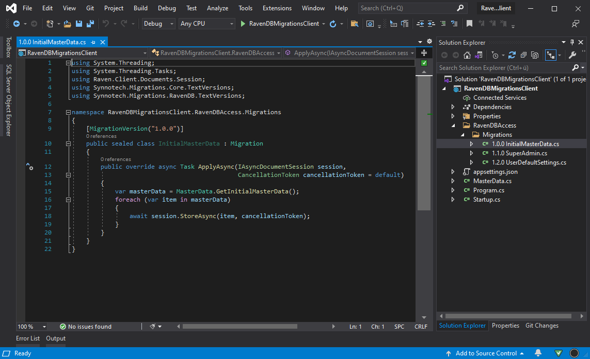

# Synnotech.Migrations.RavenDB

*Adapts the generic migration engine of Synnotech.Migrations.Core for RavenDB.*

[](https://www.synnotech.de/)

[](https://github.com/Synnotech-AG/Synnotech.Migrations/blob/main/LICENSE)
[](https://www.nuget.org/packages/Synnotech.Migrations.RavenDB/)

# How to Install

Synnotech.Migrations.RavenDB is compiled against [.NET Standard 2.0 and 2.1](https://docs.microsoft.com/en-us/dotnet/standard/net-standard) and thus supports all major plattforms like .NET 5, .NET Core, .NET Framework 4.6.1 or newer, Mono, Xamarin, UWP, or Unity.

Synnotech.Migrations.RavenDB is available as a [NuGet package](https://www.nuget.org/packages/Synnotech.Migrations.RavenDB/) and can be installed via:

- **Package Reference in csproj**: `<PackageReference Include="Synnotech.Migrations.RavenDB" Version="0.7.0" />`
- **dotnet CLI**: `dotnet add package Synnotech.Migrations.RavenDB`
- **Visual Studio Package Manager Console**: `Install-Package Synnotech.Migrations.RavenDB`

# Setting Up With the Default Configuration

If you want to run with the default setup, registration is pretty easy. Synnotech.Migrations.RavenDB already includes a base class for migrations where you can derive from, a class called `MigrationInfos` that stores metadata about the applied migrations in the target database, as well as a `SessionFactory` and `MigrationEngine` that are used to apply migrations. Let's see how you can set this up.

## Set Up in ASP.NET Core Apps

If you write an ASP.NET Core app, you can simply call `AddSynnotechMigration` in `Startup.ConfigureService`:

```csharp
public sealed class Startup
{
    public void ConfigureService(IServiceCollection services)
    {
        // You must manually register IDocumentStore to the DI container.
        // We suggest you use Synnotech.RavenDB for that.
        services.AddSynnotechMigrations();
        // other service registrations are omitted for brevity's sake
    }

    public void Configure(IApplicationBuilder app, IWebHostEnvironment environment)
    {
        // You could then run all migrations when the app starts, so that the target
        // database is on the latest version after Configure is done.
        var migrationEngine = app.ApplicationServices.GetRequiredService<MigrationEngine>();
        var summary = migrationEngine.MigrateAsync(GetType().Assembly, DateTime.UtcNow).Result;
        summary.EnsureSuccess();

        // HTTP pipeline omitted for brevity's sake
    }
}
```

`AddSynnotechMigrations` registers the `SessionFactory` as well as the `MigrationEngine` with a transient lifetime. If there is not already a registration for `IAsyncDocumentSession`, one will be created as well with a transient lifetime. Take a look at the [ServiceCollectionExtensions](https://github.com/Synnotech-AG/Synnotech.Migrations/blob/main/Code/src/Synnotech.Migrations.RavenDB/ServiceCollectionExtensions.cs) class to see what is going on exactly.

Please ensure that a registration for `IDocumentStore` is already present in the DI container. You can use [Synnotech.RavenDB](https://github.com/Synnotech-AG/Synnotech.RavenDB) to do that.

We suggest that you run your migrations at the beginning of `Startup.Configure`, so that the target database is up to date every time the web app starts. Of course, you are not limited to that - you could e.g. create a dedicated controller action that executes migrations.

## Setup in Other Apps

To instantiate the `MigrationEngine`, you need to provide an `ISessionFactory<MigrationSession, MigrationInfo>` to the constructor. This interface is implemented by `SessionFactory`. `SessionFactory` itself requires an instance of RavenDB's `IDocumentStore`. With Pure DI, you can create a migration engine instance this way:

```csharp
IDocumentStore store = InitializeDocumentStore(); // Configures connection to RavenDB server
var sessionFactory = new SessionFactory(store);
var migrationEngine = new MigrationEngine(sessionFactory);
```

If you use a DI container, you could register the types similar to the following pseudo code:

```csharp
IDocumentStore store = InitializeDocumentStore(); // Configures connection to RavenDB server
container.RegisterSingleton(store)
         .RegisterTransient<SessionFactory>()
         .RegisterTransient(c => new MigrationEngine(c.Resolve<SessionFactory>()))
```

## Writing Migrations

A migration is a `public` class that derives from the `Migration` base class and is decorated with the `MigrationVersion` attribute. It has a single method called `ApplyAsync` where you receive a `MigrationSession` that you can use to manipulate the target database.

A typical migration might look like this:

```csharp
using System.Threading.Tasks;
using Raven.Client.Documents.Session;
using Synnotech.Migrations.Core.TextVersions;
using Synnotech.Migrations.RavenDB.TextVersions;

namespace MyRavenDBAccessLayer
{
    [MigrationVersion("1.0.0")]
    public sealed class InitialMasterData : Migration
    {
        public override async Task ApplyAsync(MigrationSession context)
        {
            IAsyncDocumentSession session = context.Session;
            var masterData = MasterData.GetInitialMasterData();

            foreach(var item in masterData)
            {
                await session.StoreAsync(item);
            }
        }
    }
}
```

When writing migrations, keep the following things in mind:

1. You don't need to call `session.SaveChangesAsync` - the migration engine will do that for you.
1. Every migration gets a fresh `MigrationSession` instance. `WaitForIndexesAfterSaveChanges` is activated by default, so you can be sure that you can query data that was inserted in previous migrations.
1. Also, you do not need to add `MigrationInfo` instances manually to the database, the migration engine will do that for you.
1. The `MigrationVersion` uses the default `System.Version` class internally to determine the version. We suggest you use [Semantic Versioning](https://semver.org/) for your migrations.
1. We encourage you to organize your migations in a dedicated subfolder of your RavenDB data access folder / project (see picture below).
1. We suggest that you create a dedicated integration test that tries to apply all migrations at once to a fresh RavenDB database, thus you can be sure everything works correctly before rolling out your software.



# Applying Migrations with the Migration Engine

## Executing Migrations

The migration engine offers you three methods to apply migrations to the target database:

1. `MigrateAsync` does all in one go: it first checks the target system and tries to retrieve information about the latest applied migration. Based on this, it then determines which migrations need to be applied and executes them against the target database.
2. `GenerateMigrationPlanAsync` only checks the target database and retrieves information about the latest applied migration. It also determines which migrations need to be applied and returns both information. This is useful if the calling code wants to know if there are any pending migrations and then ask the user to confirm the database changes.
3. `ApplyMigrationsAsync` takes a list of migrations and applies them to the target database. Is often used in combination with `GenerateMigrationPlanAsync`.

In most apps, we suggest that you simply use `MigrateAsync` at application start to keep the database up-to-date. The two other methods are typically used if you have a dedicated Export-to-Database functionality where the user can agree or disagree with applying the latest migrations.

## Migration Summary

When applying migrations, the migration engine will execute all pending migrations until either all of them completed successfully, or until an exception was thrown. This exception will always be caught by the migration engine, it will then dispose the active session to the database and provide you with a summary.

You can ask this summary if any migrations were applied and if an error occured. A typical method that also logs the result looks like this:

```csharp
public static class RavenDbExtensions
{
    public static async Task MigrateAsync(this MigrationEngine migrationEngine, ILogger logger)
    {
        var summary = await migrationEngine.MigrateAsync(typeof(RavenDbExtensions).Assembly, DateTime.UtcNow);

        // First we try to log all applied migrations of this run
        if (summary.TryGetAppliedMigrations(out var appliedMigrations))
        {
            logger.Information(
                // This example uses Serilog's deconstruct feature
                "The following migrations were applied successfully: {@MigrationNames}",
                appliedMigrations.Select(migrationInfo => migrationInfo.ToString());
            );
        }
        else
        {
            logger.Information("No migrations were applied");
        }

        // A possible exception that occured during migrations will be rethrown by EnsureSuccess.
        // Alternatively, you can use summary.TryGetError to obtain the erroneous migration and
        // the exception that occurred.
        summary.EnsureSuccess();
    }
}
```
